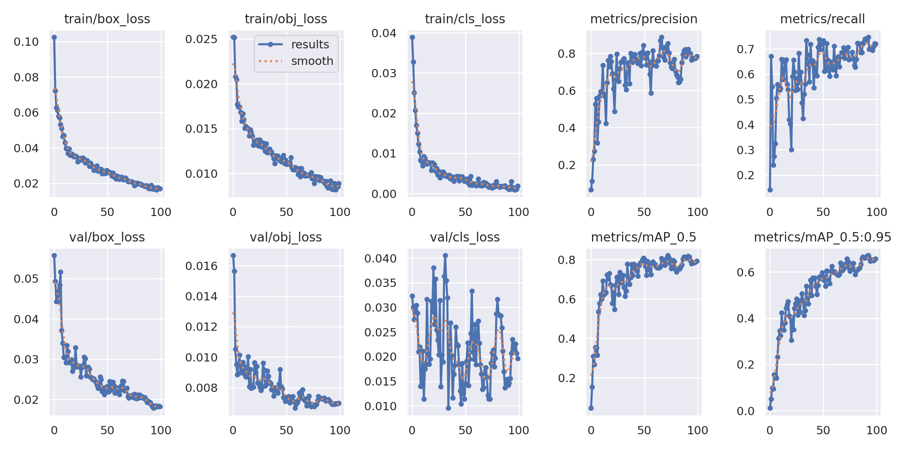
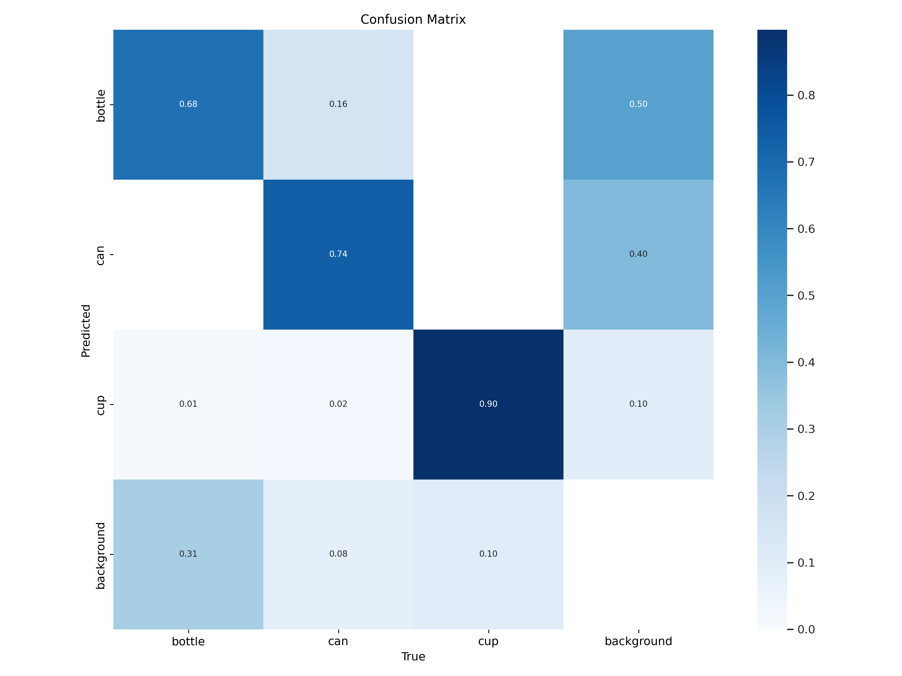

# Experiments and project history

[Back to README](../README.md)

## Experiments

The demos below are from the original project and were not re-recorded with the updated model and scripts.

  
Early experiments

Laptop and built-in webcam

Raspberry Pi and Pi Camera

Camera placement

---

### Training results

Bottle / can / cup training results

These plots were generated during the same training run as the included `best.pt`.

Training and validation losses, precision, recall, and mAP:
- Left six plots: train/validation box, objectness, and classification loss.
- Right four plots: precision, recall, mAP@0.5, and mAP@0.5:0.95.
- Blue: recorded values. Orange: smoothed trend, not a second model.

Class confusion matrix:

Original project demos

* **Final Model**
  
  

* Model Behavior Without a Drink
  

* Model Performance on Corner Case
  

* Comparison Model: Without ROI
  
  

## Project history

| Week | Work |
| --- | --- |
| 8 | Collected images |
| 9 | Built the initial YOLO and ROI pipeline |
| 10 | Added Raspberry Pi camera and buzzer control |
| 11 | Tested on Raspberry Pi and investigated low FPS |
| 12 | Reviewed comparison models during final exam week |
| 13 | Added MediaPipe hand ROIs to address speed and corner cases |
| 14 | Collected results and compared approaches |

The original comparisons used custom data, custom + COCO data, and custom + COCO data with ROI processing. The current weights and training curves belong to the later bottle/can/cup model.

## Change log

- **2026-09-29:** Updated the model and training plots, moved dataset distribution to Roboflow, and separated PC preview from Raspberry Pi alerts.
- **2025-06-10:** Added `final_drinkdetection.py`.
- **2025-05-26:** Added 46 labeled images (279 total) and updated `best.pt`.
- **2025-05-15:** Added training code and model weights.
- **2025-05-14:** Added Raspberry Pi inference, ROI processing, and buzzer output.
- **2025-05-05:** Added the initial 233 labeled images.
